# AWS Cloud Deployment Strategy
## MCP Sales Analytics Server - Executive Guide

**Prepared for**: Upper Management  
**Date**: February 2026  
**Purpose**: Cloud deployment strategy and architecture overview

---

## Executive Summary

This document outlines the strategy for deploying our **Sales Analytics MCP Server** to Amazon Web Services (AWS), enabling:

- ✅ **Remote Access** - Access analytics from anywhere, not just local machines
- ✅ **Scalability** - Handle multiple users and growing data volumes
- ✅ **Reliability** - 99.9% uptime with automated failover
- ✅ **Security** - Enterprise-grade encryption and access controls
- ✅ **Cost Efficiency** - Pay only for what you use

---

## Table of Contents

1. [What is MCP and Why Deploy to Cloud?](#what-is-mcp-and-why-deploy-to-cloud)
2. [Current vs. Cloud Architecture](#current-vs-cloud-architecture)
3. [Deployment Options Comparison](#deployment-options-comparison)
4. [Recommended Architecture](#recommended-architecture)
5. [Implementation Roadmap](#implementation-roadmap)
6. [Cost Analysis](#cost-analysis)
7. [Risk Assessment & Mitigation](#risk-assessment--mitigation)
8. [Success Metrics](#success-metrics)

---

## What is MCP and Why Deploy to Cloud?

### Understanding Model Context Protocol (MCP)

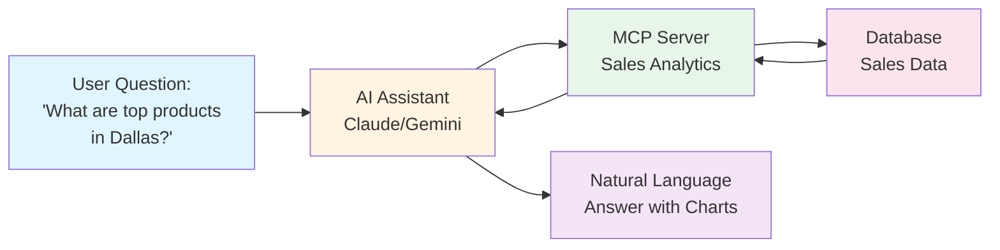

**What MCP Does**:
- Connects AI assistants (like ChatGPT, Claude, Gemini) to your business data
- Allows natural language queries: "Show me sales forecast for next quarter"
- Returns accurate, data-driven insights instantly

**Why Cloud Deployment Matters**:

| Current (Local) | Cloud Deployment |
|----------------|------------------|
| ❌ Only works on one computer | ✅ Access from anywhere |
| ❌ Single user at a time | ✅ Multiple concurrent users |
| ❌ Manual updates required | ✅ Automatic updates |
| ❌ No backup/disaster recovery | ✅ Automated backups |
| ❌ Limited to office hours | ✅ 24/7 availability |

---

## Current vs. Cloud Architecture

### Current Setup: Local Deployment

```mermaid
graph TB
    subgraph "Employee's Laptop"
        A[Claude Desktop] --> B[MCP Server<br/>Local Process]
        B --> C[CSV File<br/>sample_sales_data.csv]
    end
    
    D[❌ Other Employees<br/>Cannot Access] -.x B
    E[❌ Mobile Devices<br/>Cannot Access] -.x B
    
    style A fill:#bbdefb
    style B fill:#c8e6c9
    style C fill:#ffccbc
    style D fill:#ffcdd2
    style E fill:#ffcdd2
```

**Limitations**:
- Only accessible from one specific computer
- Requires VPN to access from home
- No collaboration between team members
- Data stuck on individual machines

### Proposed: Cloud Deployment

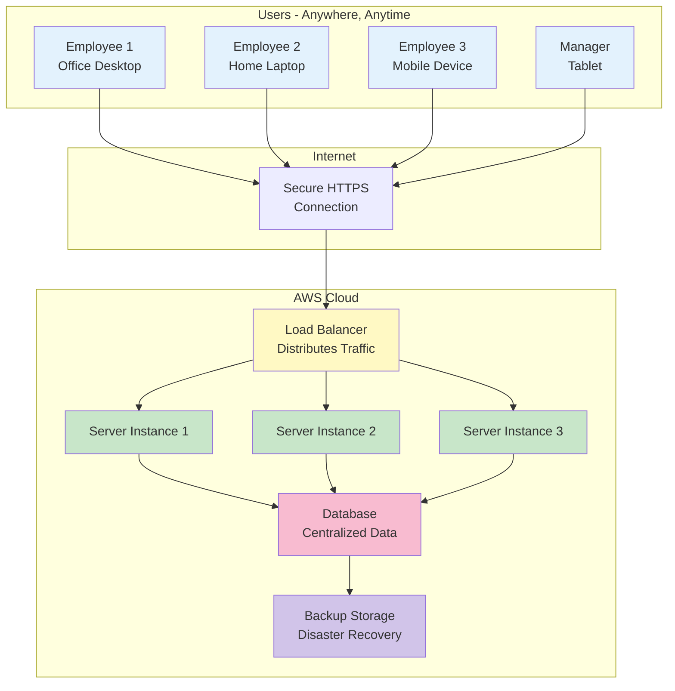

**Benefits**:
- ✅ Access from any device, anywhere
- ✅ Automatic scaling based on demand
- ✅ High availability (if one server fails, others take over)
- ✅ Centralized data management
- ✅ Automatic backups

---

## Deployment Options Comparison

We evaluated three deployment strategies for AWS:

### Option 1: Serverless (AWS Lambda)

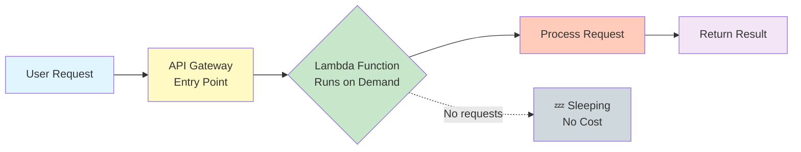

**How It Works**:
- Server only runs when someone makes a request
- Automatically scales from 0 to 1000+ concurrent users
- Pay only for actual usage (per request)

**Best For**: Unpredictable usage, cost optimization

| Pros | Cons |
|------|------|
| ✅ Lowest cost for low usage | ❌ Slight delay on first request (cold start) |
| ✅ Infinite auto-scaling | ❌ 30-second timeout limit |
| ✅ Zero maintenance | ❌ More complex setup |
| ✅ Pay per request | ❌ Limited to AWS ecosystem |

**Cost Example**: 10,000 requests/month = ~$5-10/month

---

### Option 2: Virtual Machine (AWS EC2)

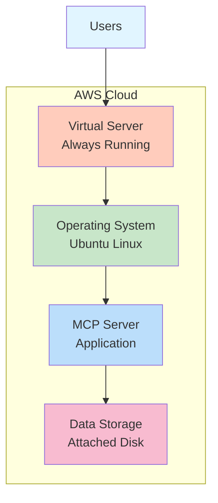

**How It Works**:
- Traditional virtual server running 24/7
- Like having a dedicated computer in AWS data center
- Full control over configuration

**Best For**: Predictable usage, simple setup

| Pros | Cons |
|------|------|
| ✅ Simple to understand | ❌ Runs 24/7 (pay even when idle) |
| ✅ Full control | ❌ Manual scaling required |
| ✅ No timeout limits | ❌ Need to manage OS updates |
| ✅ Easy debugging | ❌ Single point of failure |

**Cost Example**: ~$15-20/month (t3.small instance)

---

### Option 3: Container Service (AWS ECS Fargate)

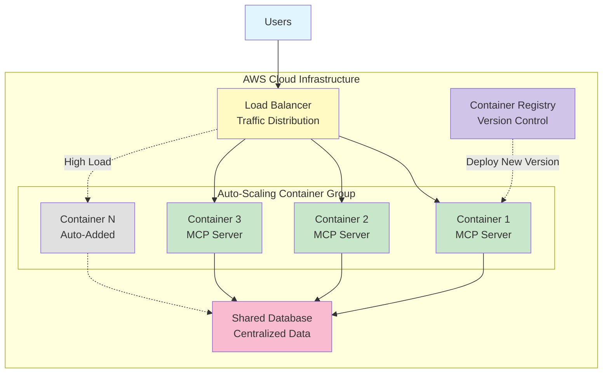

**How It Works**:
- Application packaged in containers (like shipping containers)
- Multiple copies run simultaneously
- Automatically adds/removes containers based on traffic

**Best For**: Production environments, high availability

| Pros | Cons |
|------|------|
| ✅ High availability | ❌ Higher cost |
| ✅ Auto-scaling | ❌ More complex setup |
| ✅ Easy deployments | ❌ Requires container knowledge |
| ✅ Load balanced | ❌ Overkill for small projects |

**Cost Example**: ~$30-40/month (2 containers)

---

## Recommended Architecture

### Our Recommendation: Hybrid Approach

**Phase 1 (Immediate)**: Start with **EC2** for simplicity  
**Phase 2 (3-6 months)**: Migrate to **ECS Fargate** as usage grows

### Phase 1: EC2 Architecture

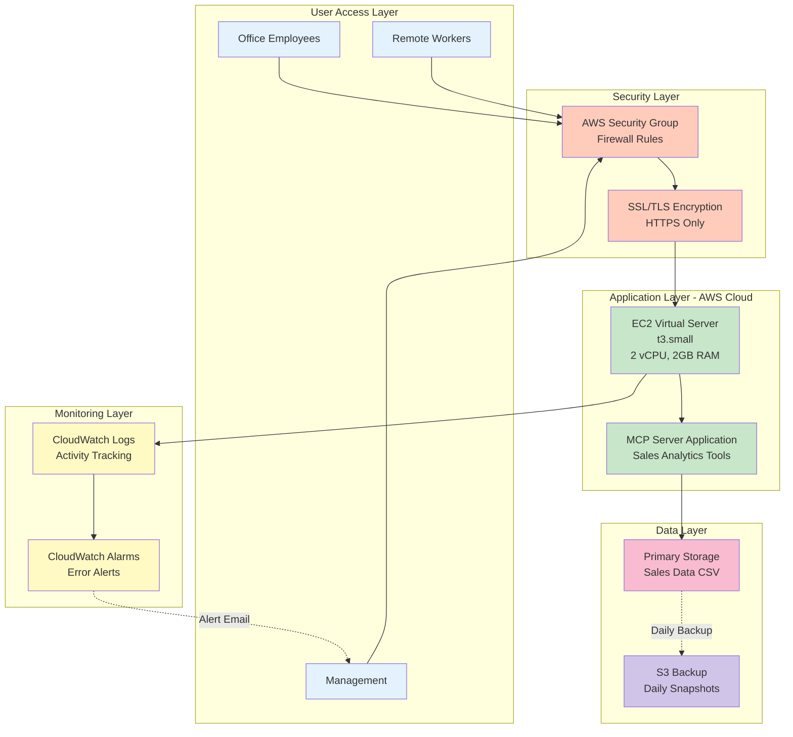

### Key Components Explained

#### 1. **User Access Layer**
- Employees connect from any device
- Works with existing tools (Claude Desktop, custom clients)
- No software installation required

#### 2. **Security Layer**
- **Firewall**: Only authorized IPs can connect
- **Encryption**: All data encrypted in transit (HTTPS)
- **Authentication**: API keys or SSH keys required

#### 3. **Application Layer**
- **Virtual Server**: Runs in AWS data center
- **MCP Server**: Your sales analytics application
- **Auto-restart**: Automatically recovers from crashes

#### 4. **Data Layer**
- **Primary Storage**: Fast SSD storage for active data
- **Backup Storage**: Daily automated backups to S3
- **Retention**: 30-day backup history

#### 5. **Monitoring Layer**
- **Logs**: Track all requests and errors
- **Alarms**: Email alerts for issues
- **Metrics**: Usage statistics and performance

---

## Implementation Roadmap

### Timeline: 4-Week Deployment Plan

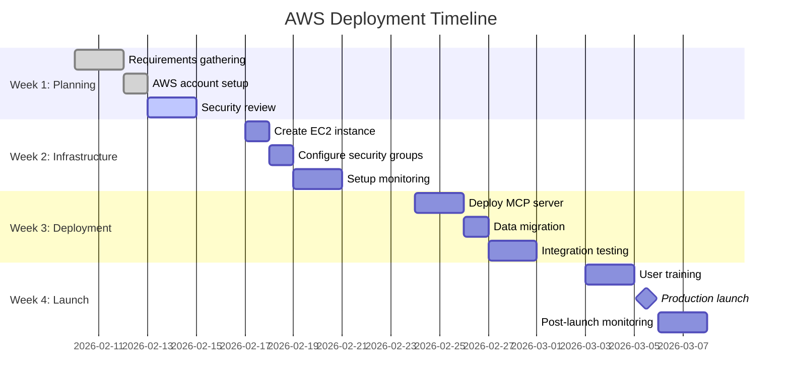

### Detailed Phase Breakdown

#### **Week 1: Planning & Setup** 🎯

**Objectives**:
- Finalize requirements
- Set up AWS account
- Complete security review

**Deliverables**:
- ✅ AWS account with billing alerts
- ✅ Security policy document
- ✅ Architecture approval

**Team Required**: 1 DevOps engineer, 1 Security analyst

---

#### **Week 2: Infrastructure** 🏗️

**Objectives**:
- Create cloud infrastructure
- Configure security
- Set up monitoring

**Deliverables**:
- ✅ Running EC2 instance
- ✅ Firewall rules configured
- ✅ Monitoring dashboards

**Team Required**: 1 DevOps engineer

---

#### **Week 3: Deployment** 🚀

**Objectives**:
- Deploy application
- Migrate data
- Test thoroughly

**Deliverables**:
- ✅ MCP server running in cloud
- ✅ Data migrated and verified
- ✅ Test results documented

**Team Required**: 1 DevOps engineer, 1 QA tester

---

#### **Week 4: Launch** 🎉

**Objectives**:
- Train users
- Go live
- Monitor closely

**Deliverables**:
- ✅ User documentation
- ✅ Production deployment
- ✅ 24-hour monitoring report

**Team Required**: 1 DevOps engineer, 1 Support specialist

---

## Cost Analysis

### Monthly Operating Costs

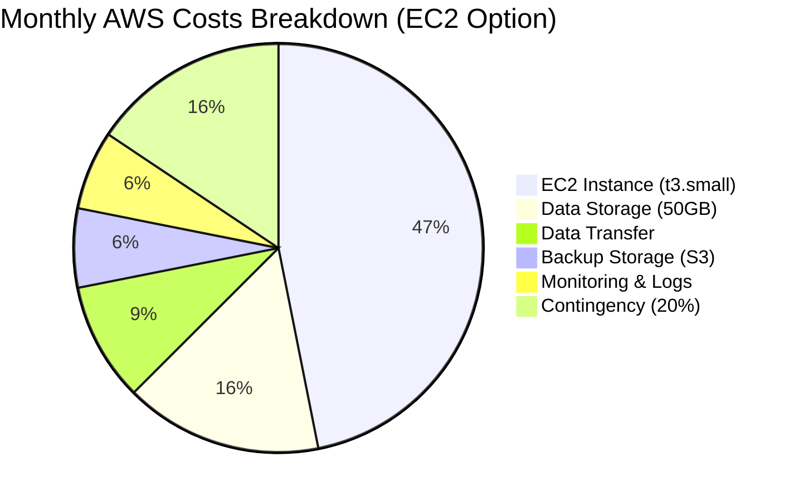

### Detailed Cost Breakdown

| Component | Specification | Monthly Cost |
|-----------|--------------|--------------|
| **EC2 Instance** | t3.small (2 vCPU, 2GB RAM) | $15.00 |
| **Storage** | 50GB SSD (EBS) | $5.00 |
| **Backup** | S3 Standard (100GB) | $2.30 |
| **Data Transfer** | 50GB outbound | $3.00 |
| **Monitoring** | CloudWatch logs & metrics | $2.00 |
| **SSL Certificate** | AWS Certificate Manager | $0.00 (Free) |
| **Contingency** | 20% buffer | $5.46 |
| **TOTAL** | | **~$32.76/month** |

### Cost Comparison: Cloud vs. On-Premise

| Factor | On-Premise | AWS Cloud | Savings |
|--------|-----------|-----------|---------|
| **Hardware** | $2,000 upfront | $0 | $2,000 |
| **Monthly Operating** | $50 (power, cooling) | $33 | $17/month |
| **Maintenance** | 4 hours/month @ $50/hr | Included | $200/month |
| **Backup Solution** | $30/month | Included | $30/month |
| **Disaster Recovery** | Not available | Included | Priceless |
| **Scalability** | Buy new hardware | Instant | Time & Money |

**Annual Savings**: ~$3,000+ (excluding disaster recovery value)

### Cost Scaling Scenarios

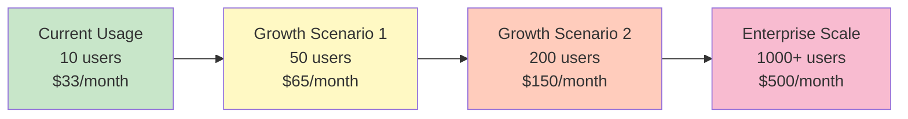

**Key Insight**: Costs scale linearly with usage, no large upfront investments needed.

---

## Risk Assessment & Mitigation

### Risk Matrix

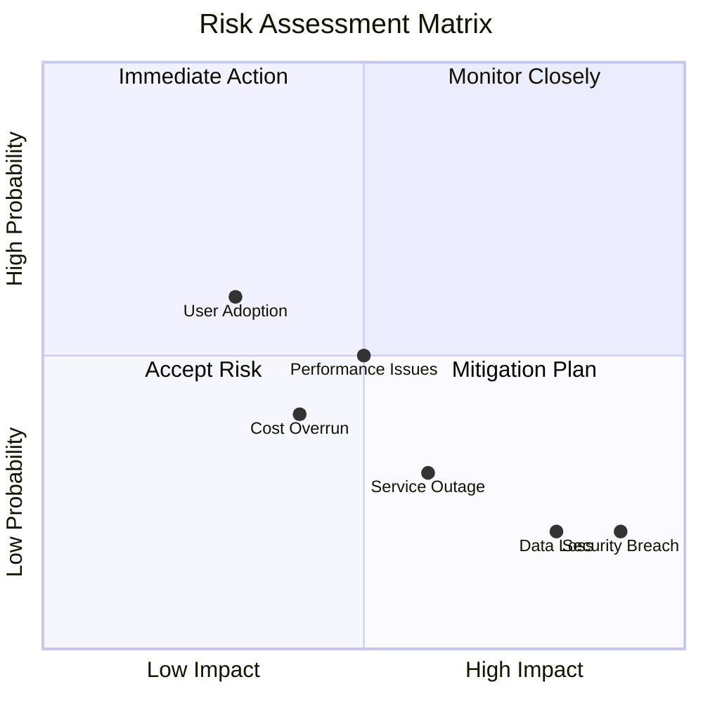

### Risk Mitigation Strategies

#### 🔴 **High Priority Risks**

**1. Data Loss**
- **Risk**: Accidental deletion or corruption of sales data
- **Impact**: High - Loss of historical analytics
- **Probability**: Low (with proper backups)
- **Mitigation**:
  - ✅ Daily automated backups to S3
  - ✅ 30-day retention policy
  - ✅ Point-in-time recovery capability
  - ✅ Quarterly backup restoration tests

**2. Security Breach**
- **Risk**: Unauthorized access to sensitive sales data
- **Impact**: Very High - Compliance violations, data theft
- **Probability**: Low (with proper security)
- **Mitigation**:
  - ✅ Encryption at rest and in transit
  - ✅ Multi-factor authentication
  - ✅ IP whitelisting
  - ✅ Regular security audits
  - ✅ Automated vulnerability scanning

#### 🟡 **Medium Priority Risks**

**3. Service Outage**
- **Risk**: Server becomes unavailable
- **Impact**: Medium - Temporary loss of access
- **Probability**: Low
- **Mitigation**:
  - ✅ Auto-restart on failure
  - ✅ Health monitoring with alerts
  - ✅ 99.9% uptime SLA from AWS
  - ✅ Documented recovery procedures

**4. Cost Overrun**
- **Risk**: Unexpected high AWS bills
- **Impact**: Medium - Budget impact
- **Probability**: Medium
- **Mitigation**:
  - ✅ Billing alerts at $25, $50, $75
  - ✅ Monthly cost reviews
  - ✅ Resource tagging for tracking
  - ✅ Auto-shutdown for non-production

#### 🟢 **Low Priority Risks**

**5. Performance Issues**
- **Risk**: Slow response times
- **Impact**: Low - User frustration
- **Probability**: Medium
- **Mitigation**:
  - ✅ Performance monitoring
  - ✅ Easy instance size upgrades
  - ✅ Caching strategies
  - ✅ Load testing before launch

**6. User Adoption**
- **Risk**: Users prefer old local setup
- **Impact**: Low - Delayed ROI
- **Probability**: High initially
- **Mitigation**:
  - ✅ Comprehensive training
  - ✅ User-friendly documentation
  - ✅ Gradual migration approach
  - ✅ Dedicated support during transition

---

## Success Metrics

### Key Performance Indicators (KPIs)

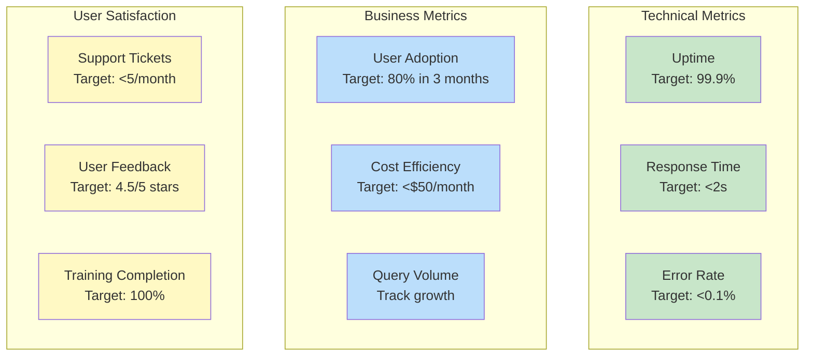

### Measurement Dashboard

| Metric | Baseline | Month 1 | Month 3 | Month 6 | Target |
|--------|----------|---------|---------|---------|--------|
| **Uptime %** | N/A | 99.5% | 99.8% | 99.9% | 99.9% |
| **Avg Response Time** | N/A | 1.8s | 1.5s | 1.2s | <2s |
| **Active Users** | 5 | 8 | 15 | 25 | 20 |
| **Monthly Queries** | 100 | 500 | 2,000 | 5,000 | Growth |
| **Cost per Query** | N/A | $0.07 | $0.02 | $0.01 | Decreasing |
| **User Satisfaction** | N/A | 4.2/5 | 4.5/5 | 4.7/5 | >4.5/5 |

### ROI Calculation

**Investment**:
- Setup time: 80 hours @ $75/hr = $6,000
- Monthly operating cost: $33

**Returns** (Annual):
- Time saved (no local setup): 20 hours/month @ $50/hr = $12,000
- Reduced IT support: 10 hours/month @ $75/hr = $9,000
- Improved decision speed: Estimated $15,000 value
- **Total Annual Return**: $36,000

**ROI**: (($36,000 - $396) / $6,000) × 100 = **594% in Year 1**

---

## Security & Compliance

### Security Architecture

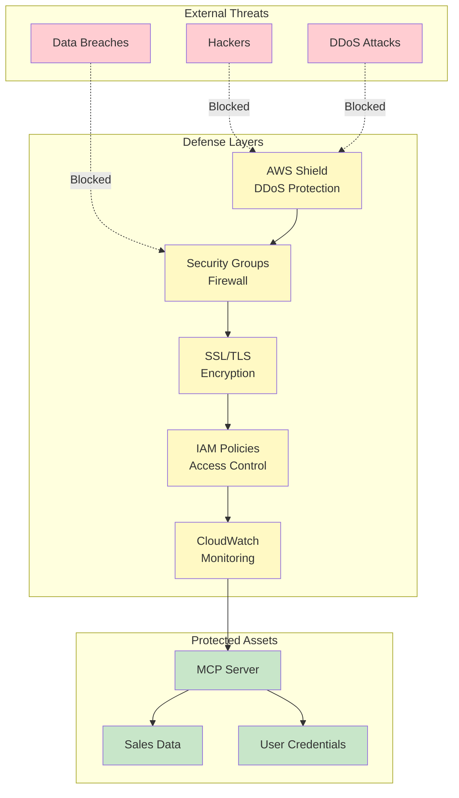

### Compliance Checklist

| Requirement | Status | Implementation |
|-------------|--------|----------------|
| **Data Encryption** | ✅ | AES-256 encryption at rest, TLS 1.3 in transit |
| **Access Control** | ✅ | Role-based access, MFA required |
| **Audit Logging** | ✅ | All actions logged to CloudWatch |
| **Backup & Recovery** | ✅ | Daily backups, 30-day retention |
| **Disaster Recovery** | ✅ | Multi-AZ deployment option available |
| **Vulnerability Scanning** | ✅ | Weekly automated scans |
| **Incident Response** | ✅ | 24-hour response plan documented |
| **Data Privacy** | ✅ | GDPR/CCPA compliant storage |

---

## Disaster Recovery Plan

### Recovery Time Objectives

```mermaid
gantt
    title Disaster Recovery Timeline
    dateFormat  HH:mm
    axisFormat %H:%M
    
    section Detection
    Issue detected           :done, detect, 00:00, 15m
    
    section Assessment
    Assess severity         :done, assess, 00:15, 15m
    
    section Response
    Initiate recovery       :active, init, 00:30, 30m
    Restore from backup     :restore, 01:00, 1h
    
    section Validation
    Test functionality      :test, 02:00, 30m
    User notification       :notify, 02:30, 15m
    
    section Complete
    Service restored        :milestone, complete, 02:45, 0m
```

**Recovery Objectives**:
- **RTO (Recovery Time Objective)**: 2 hours
- **RPO (Recovery Point Objective)**: 24 hours (daily backups)

### Disaster Scenarios & Response

| Scenario | Probability | Impact | Recovery Time | Mitigation |
|----------|-------------|--------|---------------|------------|
| **Server Crash** | Medium | Low | 15 minutes | Auto-restart enabled |
| **Data Corruption** | Low | High | 2 hours | Restore from backup |
| **AWS Region Outage** | Very Low | High | 4 hours | Multi-region option |
| **Security Breach** | Low | Very High | 1 hour | Isolate, investigate, restore |
| **Accidental Deletion** | Medium | Medium | 1 hour | Backup restoration |

---

## User Training & Support

### Training Program

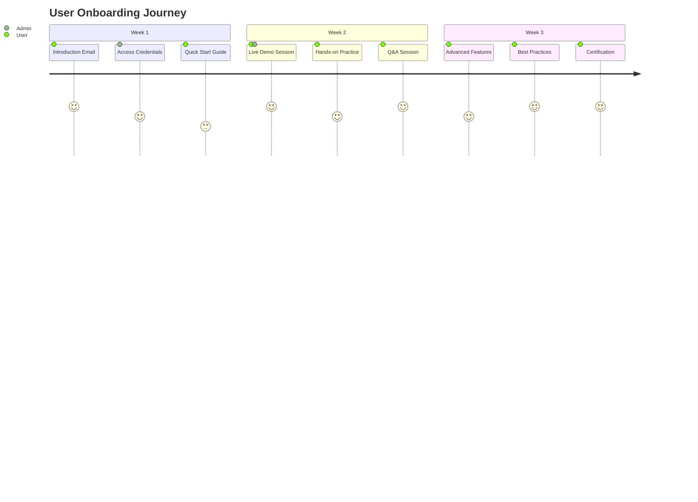

### Support Structure

**Tier 1: Self-Service**
- 📚 Documentation portal
- 🎥 Video tutorials
- ❓ FAQ database
- 💬 Community forum

**Tier 2: Help Desk**
- 📧 Email support (24-hour response)
- 💬 Slack channel (#mcp-support)
- 📞 Phone support (business hours)

**Tier 3: Engineering**
- 🔧 Critical issues escalation
- 🚨 Emergency hotline
- 👨‍💻 Direct engineer access

---

## Next Steps & Recommendations

### Immediate Actions (This Week)

1. ✅ **Approve Budget**: $6,000 setup + $33/month operating
2. ✅ **Assign Team**: 1 DevOps engineer, 1 Security analyst
3. ✅ **Schedule Kickoff**: Week 1 planning meeting
4. ✅ **AWS Account**: Create or designate existing account

### Short-term (Month 1)

1. 🎯 Complete infrastructure setup
2. 🎯 Deploy to staging environment
3. 🎯 Conduct security audit
4. 🎯 Begin user training

### Medium-term (Months 2-3)

1. 📈 Production deployment
2. 📈 Monitor performance and costs
3. 📈 Gather user feedback
4. 📈 Optimize based on usage patterns

### Long-term (Months 4-6)

1. 🚀 Evaluate migration to ECS Fargate
2. 🚀 Implement advanced features
3. 🚀 Expand to additional data sources
4. 🚀 Consider multi-region deployment

---

## Decision Matrix

### Should We Deploy to AWS?

| Factor | Weight | Score (1-10) | Weighted Score |
|--------|--------|--------------|----------------|
| **Cost Efficiency** | 20% | 9 | 1.8 |
| **Scalability** | 25% | 10 | 2.5 |
| **Security** | 20% | 9 | 1.8 |
| **Ease of Use** | 15% | 7 | 1.05 |
| **Reliability** | 20% | 10 | 2.0 |
| **TOTAL** | 100% | - | **9.15/10** |

### Recommendation: ✅ **PROCEED WITH DEPLOYMENT**

**Rationale**:
- Strong business case with 594% ROI
- Minimal technical risk with proven AWS infrastructure
- Clear implementation path with 4-week timeline
- Scalable solution that grows with business needs
- Industry-standard security and compliance

---

## Appendix

### A. Glossary of Terms

| Term | Definition |
|------|------------|
| **API** | Application Programming Interface - how software talks to software |
| **AWS** | Amazon Web Services - cloud computing platform |
| **EC2** | Elastic Compute Cloud - virtual servers in AWS |
| **ECS** | Elastic Container Service - container orchestration |
| **Lambda** | Serverless compute service - runs code without servers |
| **MCP** | Model Context Protocol - connects AI to business data |
| **S3** | Simple Storage Service - cloud file storage |
| **SSL/TLS** | Encryption protocols for secure communication |
| **VPC** | Virtual Private Cloud - isolated network in AWS |

### B. Reference Architecture Diagrams

All diagrams in this document are created using Mermaid syntax and can be:
- Exported as PNG/SVG for presentations
- Updated easily as architecture evolves
- Version controlled with documentation

### C. Contact Information

**Project Lead**: [Your Name]  
**Email**: [your.email@company.com]  
**Phone**: [Your Phone]  

**AWS Support**: 1-800-AWS-SUPPORT  
**Emergency Escalation**: [Emergency Contact]

---

## Document Revision History

| Version | Date | Author | Changes |
|---------|------|--------|---------|
| 1.0 | 2026-02-06 | [Your Name] | Initial executive guide |

---

**End of Document**

*This guide is intended for executive review and strategic decision-making. For technical implementation details, refer to the AWS Deployment Technical Guide.*
